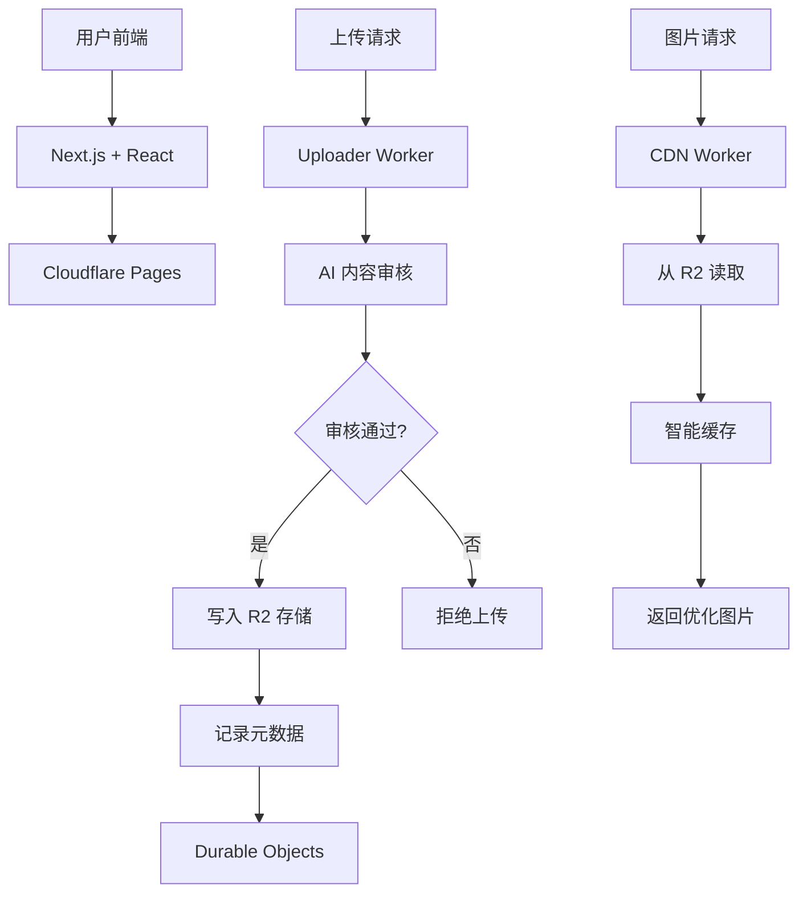

# 🌟 PicoPics

> **现代化、高性能的图片托管服务** - 基于 Cloudflare 生态系统构建

[](https://opensource.org/licenses/MIT)
[](https://cloudflare.com)
[](https://nextjs.org)
[](https://www.typescriptlang.org)
[](https://tailwindcss.com)

<div align="center">
  
  <br>
  <em>安全 · 快速 · 免费 · AI 驱动</em>
</div>

---

## ✨ 特性亮点

### 🚀 高性能架构

- **全球 CDN 加速** - Cloudflare 边缘网络，全球 300+ 个数据中心
- **毫秒级响应** - 智能缓存和边缘计算优化
- **无限扩展** - 无服务器架构，按需扩展

### 🔒 企业级安全

- **GitHub OAuth 认证** - 安全的身份验证系统
- **AI 内容审核** - 智能识别和过滤不当内容
- **DDoS 防护** - Cloudflare 企业级安全防护

### 🎨 现代化体验

- **响应式设计** - 完美适配桌面和移动设备
- **拖拽上传** - 支持拖拽、粘贴和点击上传
- **实时预览** - 即时图片预览和格式转换

### 💰 成本优化

- **按量付费** - 只为实际使用的存储和流量付费
- **智能压缩** - 自动优化图片大小和质量
- **长期存储** - 基于 Cloudflare R2 的成本效益存储

---

## 🏗️ 技术架构



### 核心组件

| 组件         | 技术栈                          | 职责                         |
| ------------ | ------------------------------- | ---------------------------- |
| **前端界面** | Next.js 14 + React + TypeScript | 用户交互和文件上传           |
| **上传服务** | Cloudflare Workers              | 身份验证、内容审核、文件处理 |
| **存储层**   | Cloudflare R2                   | 高持久性对象存储             |
| **状态管理** | Durable Objects                 | 配额控制和速率限制           |
| **AI 服务**  | Cloudflare AI                   | 智能内容审核和分析           |
| **CDN 网络** | Cloudflare CDN                  | 全球内容分发和缓存           |

---

## 🚀 快速开始

### 前置要求

- Node.js 18+
- npm 或 yarn
- Cloudflare 账户

### 安装步骤

1. **克隆项目**

   ```bash
   git clone https://github.com/KaikiDeishuuu/PicoPics.git
   cd PicoPics
   ```

2. **安装依赖**

   ```bash
   npm install
   ```

3. **配置环境**

   ```bash
   cp .env.example .env.local
   # 编辑 .env.local 配置你的 Cloudflare 凭据
   ```

4. **创建 R2 存储桶**

   ```bash
   npx wrangler r2 bucket create your-bucket-name
   ```

5. **部署服务**

   ```bash
   # 部署 Workers
   npx wrangler deploy

   # 部署前端
   npm run build
   npx wrangler pages deploy out
   ```

6. **查看日志**
   ```bash
   npx wrangler tail
   ```

📖 **详细部署指南**：[DEPLOY_GUIDE.md](./DEPLOY_GUIDE.md)

---

## 📁 项目结构

```
PicoPics/
├── 📁 cdn-worker/          # CDN 内容分发 Worker
├── 📁 uploader-worker/     # 上传处理 Worker
├── 📁 CFworkerImageFRONTED/# Next.js 前端应用
│   ├── 📁 src/
│   │   ├── 📁 app/         # App Router 页面
│   │   ├── 📁 components/  # React 组件
│   │   └── 📁 services/    # API 服务
│   └── 📁 public/          # 静态资源
├── 📄 DEPLOY_GUIDE.md      # 详细部署指南
├── 📄 SECURITY.md          # 安全说明
├── 📄 LICENSE              # MIT 许可证
└── 📄 README.md            # 项目说明
```

---

## 🎯 使用指南

### 上传图片

1. **访问网站** - 打开部署后的网站地址
2. **GitHub 登录** - 使用 GitHub 账户授权登录
3. **上传文件** - 支持以下方式：
   - 点击上传区域选择文件
   - 拖拽文件到上传区域
   - 按 `Ctrl+V` 粘贴图片
4. **获取链接** - 上传完成后自动生成多种格式的链接

### 支持格式

- **图片格式**: JPG, PNG, GIF, WebP, SVG
- **最大尺寸**: 10MB
- **批量上传**: 支持多文件同时上传

---

## 🔧 API 参考

### 上传接口

```typescript
POST /upload
Authorization: Bearer <token>
Content-Type: multipart/form-data

// 响应
{
  "success": true,
  "url": "https://cdn.example.com/image.jpg",
  "fileName": "image.jpg",
  "size": 1024000,
  "type": "image/jpeg"
}
```

### 获取配额

```typescript
GET /quota
Authorization: Bearer <token>

// 响应
{
  "used": 50000000,
  "limit": 100000000,
  "resetTime": "2024-12-31T23:59:59Z"
}
```

---

## 🤝 贡献指南

我们欢迎各种形式的贡献！

### 开发环境设置

```bash
# 安装依赖
npm install

# 启动开发服务器
npm run dev

# 运行测试
npm test

# 代码检查
npm run lint
```

### 提交规范

- 使用 [Conventional Commits](https://conventionalcommits.org/) 格式
- 提交前请运行 `npm run lint` 和 `npm test`
- 为新功能创建对应的 Issue

---

## 📄 许可证

本项目采用 **MIT 许可证** 开源协议 - 详见 [LICENSE](./LICENSE) 文件

---

## 📞 联系我们

- **GitHub**: [https://github.com/KaikiDeishuuu/PicoPics](https://github.com/KaikiDeishuuu/PicoPics)
- **Telegram**: [@OnonokiiBOT](https://t.me/OnonokiiBOT)
- **作者**: [Kaiki](https://github.com/KaikiDeishuuu)

---

<div align="center">

**🌟 如果这个项目对你有帮助，请给我们一个 Star！🌟**

[](https://star-history.com/#KaikiDeishuuu/PicoPics&Date)

</div>
