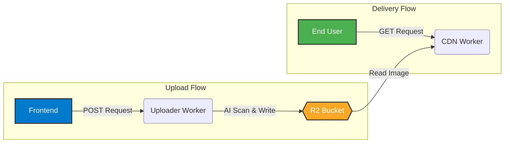

<div align="center">
  <h1 style="font-size: 3em; font-weight: bold;">PicoPics</h1>
  <p>
    <strong>A full-stack, AI-powered image hosting service built on the Cloudflare ecosystem.</strong>
  </p>
  <p>
    High-performance, secure, and cost-effective solution for image uploads and delivery, designed for developers and communities.
  </p>
</div>

<p align="center">
  
  
  
  
  
</p>

---

## Core Features

-   **Global CDN Delivery**: All images are served through the Cloudflare edge network for maximum speed and low latency worldwide.
-   **Secure Authentication**: User access is managed through a secure GitHub OAuth 2.0 flow.
-   **AI-Powered Content Moderation**: Automatically scans uploads using Cloudflare AI to detect and block inappropriate content.
-   **Robust Abuse Protection**: Built-in mechanisms like IP blacklisting and rate limiting to prevent misuse.
-   **Quota Management**: Enforces daily upload limits to ensure fair usage and control costs.
-   **Optimized Performance**: The client-side uploader supports image compression and chunked uploads for a fast and reliable user experience.

---

## Architecture Overview

The service is designed with a decoupled microservices architecture, leveraging the strengths of the Cloudflare serverless platform. The entire process is split into two main flows:



---

## Technology Stack

| Category           | Technology                                        |
| ------------------ | ------------------------------------------------- |
| **Backend Compute**  | Cloudflare Workers                                |
| **Storage**        | Cloudflare R2 Storage                             |
| **AI Moderation**  | Cloudflare AI (ResNet-50 for Image Classification)|
| **State Management**| Cloudflare Durable Objects                        |
| **Frontend**       | Next.js 14 (App Router) & React                   |
| **Language**       | TypeScript                                        |
| **Styling**        | Tailwind CSS                                      |
| **Hosting**        | Cloudflare Pages                                  |

---

## Getting Started

### Prerequisites

-   Node.js and npm
-   A Cloudflare account
-   [Wrangler CLI](https://developers.cloudflare.com/workers/wrangler/install-and-update/) installed and authenticated.

### 1. Clone the Repository

```bash
git clone https://github.com/KaikiDeishuuu/PicoPics.git
cd PicoPics
```

### 2. Deploy Backend & Frontend

This project is a monorepo. Detailed deployment steps for each service are located in their respective directories. For a complete walkthrough, please refer to the main deployment guide.

-   **[DEPLOY_GUIDE.md](./DEPLOY_GUIDE.md)**: **Start here!** This is the comprehensive guide for deploying the entire service from start to finish.

### 3. Configure Environment Variables

Securely set up your environment variables and secrets (e.g., GitHub OAuth credentials) using the Wrangler CLI as described in the deployment guide.

```bash
# Example for setting a secret for the uploader worker
npx wrangler secret put GITHUB_CLIENT_ID --name worker-uploader
```

---

## Project Structure

The repository is organized with a clear separation of concerns between the frontend and backend services.

```PicoPics/
├── worker-uploader/          # Worker for handling uploads and business logic
├── worker-cdn/               # High-performance Worker for image delivery
├── frontend/                 # Next.js frontend application
├── DEPLOY_GUIDE.md           # Comprehensive deployment instructions
├── SECURITY.md               # Security policy and vulnerability reporting
└── README.md                 # This file
```

---

## Documentation & License

-   **Deployment**: For detailed setup instructions, see the **[DEPLOY_GUIDE.md](./DEPLOY_GUIDE.md)**.
-   **Security**: To learn about the security policy or report a vulnerability, please read **[SECURITY.md](./SECURITY.md)**.
-   **License**: This project is licensed under the **MIT License**. See the [LICENSE](LICENSE) file for details.

<br>

<div align="center">
  Created by <a href="https://github.com/KaikiDeishuuu"><strong>Kaiki</strong></a>
</div>
