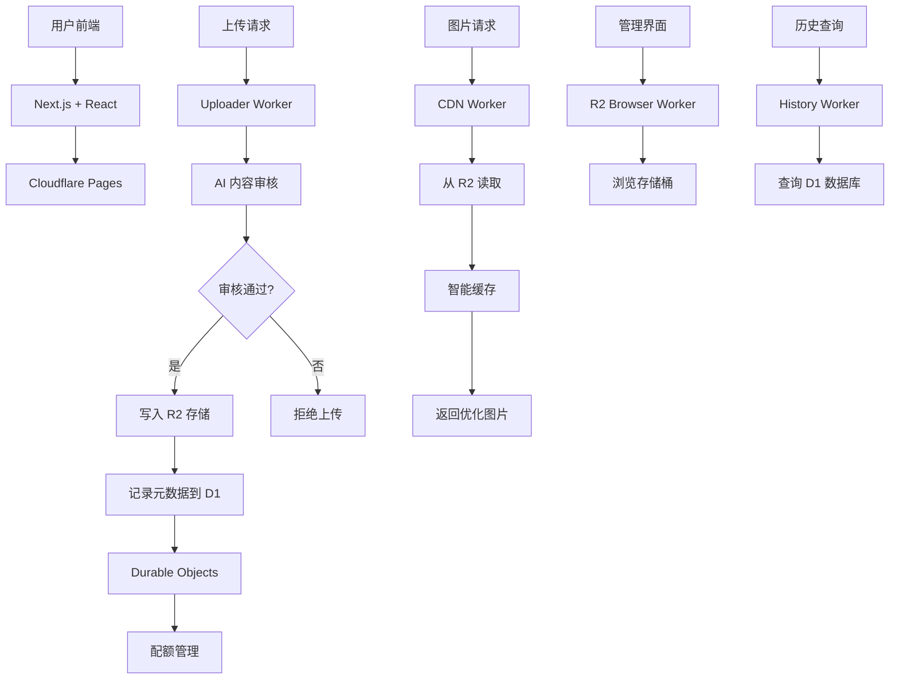

# 🌟 PicoPics

> **现代化、高性能的图片托管服务** - 基于 Cloudflare 生态系统构建

[](https://opensource.org/licenses/MIT)
[](https://cloudflare.com)
[](https://nextjs.org)
[](https://www.typescriptlang.org)
[](https://tailwindcss.com)
[](https://a6880d5f.cfworker-image-frontend.pages.dev)

<div align="center">
  <a href="https://a6880d5f.cfworker-image-frontend.pages.dev" target="_blank">
    
  </a>
  <br>
  <em>安全 · 快速 · 免费 · AI 驱动 · 已部署</em>
</div>

---

## ✨ 特性亮点

### 🚀 高性能架构

- **全球 CDN 加速** - Cloudflare 边缘网络，全球 300+ 个数据中心
- **毫秒级响应** - 智能缓存和边缘计算优化
- **无限扩展** - 无服务器架构，按需扩展
- **实时部署** - 一键部署脚本，自动化 CI/CD

### 🔒 企业级安全

- **GitHub OAuth 认证** - 安全的身份验证系统
- **AI 内容审核** - 智能识别和过滤不当内容
- **DDoS 防护** - Cloudflare 企业级安全防护
- **安全配置** - 敏感信息通过 wrangler secret 管理，绝不提交到 Git
- **IP 黑名单** - 自动检测和封禁滥用行为

### 🎨 现代化体验

- **响应式设计** - 完美适配桌面和移动设备
- **拖拽上传** - 支持拖拽、粘贴和点击上传
- **实时预览** - 即时图片预览和格式转换
- **多格式支持** - JPG, PNG, GIF, WebP, SVG
- **批量上传** - 支持多文件同时上传

### 💰 成本优化

- **按量付费** - 只为实际使用的存储和流量付费
- **智能压缩** - 自动优化图片大小和质量
- **长期存储** - 基于 Cloudflare R2 的成本效益存储
- **配额管理** - 灵活的用户配额和速率限制

### 🛠️ 开发者友好

- **自动化配置** - `setup-env.sh` 脚本一键配置所有环境
- **安全部署** - `deploy.sh` 脚本一键部署所有组件
- **完整文档** - 详细的配置和部署指南
- **TypeScript** - 完整的类型安全和开发体验

---

## 🏗️ 技术架构



### 核心组件

| 组件         | 技术栈                          | 职责                         | 部署状态  |
| ------------ | ------------------------------- | ---------------------------- | --------- |
| **前端界面** | Next.js 14 + React + TypeScript | 用户交互和文件上传           | ✅ 已部署 |
| **上传服务** | Cloudflare Workers + AI         | 身份验证、内容审核、文件处理 | ✅ 已部署 |
| **存储层**   | Cloudflare R2                   | 高持久性对象存储             | ✅ 已配置 |
| **数据库**   | Cloudflare D1                   | 元数据存储和查询             | ✅ 已配置 |
| **缓存层**   | Cloudflare KV                   | 用户会话和缓存               | ✅ 已配置 |
| **状态管理** | Durable Objects                 | 配额控制和速率限制           | ✅ 已部署 |
| **管理界面** | Cloudflare Workers              | 存储桶内容管理               | ✅ 已部署 |
| **历史服务** | Cloudflare Workers + D1         | 上传历史查询                 | ✅ 已部署 |
| **CDN 网络** | Cloudflare CDN                  | 全球内容分发和缓存           | ✅ 已部署 |

### 部署架构

```
🌐 全球用户
    ↓
🖥️  Cloudflare Edge Network (300+ 数据中心)
    ↓
📱 Next.js 前端 (Pages)
    ↙        ↘
🏗️  API Workers    🗄️  存储服务
    ↓              ↓
🔐 认证 & 审核    💾 R2 + D1 + KV
    ↓              ↓
📊 业务逻辑       ⚡ 边缘计算
```

---

## 🚀 快速开始

### 前置要求

- Node.js 18+
- npm 或 yarn
- Cloudflare 账户

### 安装步骤

1. **克隆项目**

   ```bash
   git clone https://github.com/your-username/PicoPics.git
   cd PicoPics
   ```

2. **安装依赖**

   ```bash
   # 安装根目录依赖
   npm install

   # 安装所有 Worker 依赖
   cd uploader-worker && npm install && cd ..
   cd history-worker && npm install && cd ..
   cd r2-browser-worker && npm install && cd ..
   cd cdn-worker && npm install && cd ..
   cd CFworkerImageFRONTED && npm install && cd ..
   ```

3. **配置 Cloudflare 账户**

   ```bash
   # 登录 Cloudflare（必需）
   npx wrangler login

   # 验证登录状态
   npx wrangler whoami
   ```

4. **运行自动配置脚本**

   ```bash
   # 🚀 一键安全配置（推荐）
   ./setup-env.sh
   ```

   脚本会自动：

   - 检查 Cloudflare 登录状态
   - 收集你的域名和资源名称
   - 动态生成安全的 `wrangler.toml` 配置文件
   - 设置所有环境变量和资源绑定
   - 配置前端应用环境变量

5. **手动设置敏感变量（可选）**

   ```bash
   # 管理员配置
   npx wrangler secret put ADMIN_USERS --env production
   # 输入: github_username1,github_username2

   npx wrangler secret put ADMIN_TOKEN --env production
   # 输入: your-secure-admin-token

   # Telegram 通知（可选）
   npx wrangler secret put TELEGRAM_BOT_TOKEN --env production
   npx wrangler secret put TELEGRAM_CHAT_ID --env production
   ```

6. **部署项目**

   ```bash
   # 部署所有组件
   ./deploy.sh
   ```

📖 **详细配置指南**：[CONFIG_GUIDE.md](./CONFIG_GUIDE.md)

� **安全说明**：[SECURITY.md](./SECURITY.md)

---

## 📁 项目结构

```
PicoPics/
├── 📁 cdn-worker/              # CDN 内容分发 Worker
│   ├── 📄 wrangler.toml        # Worker 配置 (安全版本)
│   ├── � package.json         # 依赖管理
│   └── 📄 src/index.ts         # CDN 逻辑
├── �📁 uploader-worker/         # 上传处理 Worker
│   ├── 📄 wrangler.toml        # Worker 配置 (安全版本)
│   ├── 📄 package.json         # 依赖管理
│   └── 📄 src/
│       ├── 📄 index.ts         # 主上传逻辑
│       ├── 📄 ip_blacklist.ts  # IP 黑名单管理
│       ├── 📄 types.ts         # 类型定义
│       └── 📄 upload_quota.ts  # 上传配额管理
├── 📁 history-worker/          # 历史查询 Worker
│   ├── 📄 wrangler.toml        # Worker 配置 (安全版本)
│   ├── 📄 package.json         # 依赖管理
│   └── 📄 src/index.ts         # 历史查询逻辑
├── 📁 r2-browser-worker/       # 管理界面 Worker
│   ├── 📄 wrangler.toml        # Worker 配置 (安全版本)
│   ├── 📄 package.json         # 依赖管理
│   └── 📄 src/index.ts         # 存储桶浏览逻辑
├── 📁 CFworkerImageFRONTED/    # Next.js 前端应用
│   ├── 📄 wrangler.toml        # Pages 配置 (安全版本)
│   ├── 📄 package.json         # 依赖管理
│   ├── � next.config.js       # Next.js 配置
│   ├── 📄 tailwind.config.ts   # Tailwind CSS 配置
│   └── �📁 src/
│       ├── 📁 app/             # App Router 页面
│       │   ├── 📄 layout.tsx   # 根布局
│       │   ├── 📄 page.tsx     # 首页
│       │   └── 📁 admin/       # 管理页面
│       ├── 📁 components/      # React 组件
│       │   ├── 📄 UploadZone.tsx    # 上传区域
│       │   ├── 📄 ResultDisplay.tsx # 结果显示
│       │   ├── 📄 UserInfo.tsx      # 用户信息
│       │   └── 📄 GitHubLogin.tsx   # GitHub 登录
│       ├── 📁 services/        # API 服务
│       │   ├── 📄 auth.ts      # 认证服务
│       │   └── 📄 upload.ts    # 上传服务
│       └── 📁 types/           # 类型定义
├── 📄 setup-env.sh             # 🔐 安全环境配置脚本
├── 📄 deploy.sh                # 🚀 一键部署脚本
├── 📄 CONFIG_GUIDE.md          # 📖 详细配置指南
├── 📄 DEPLOY_GUIDE.md          # 📋 部署指南
├── 📄 SECURITY.md              # 🔒 安全说明
├── 📄 LICENSE                  # 📄 MIT 许可证
└── 📄 README.md                # 📖 项目说明
```

## 📊 部署状态

### 🌐 线上服务

| 服务名称     | 部署地址                                                                                                 | 状态      | 功能描述           |
| ------------ | -------------------------------------------------------------------------------------------------------- | --------- | ------------------ |
| **前端应用** | [https://a6880d5f.cfworker-image-frontend.pages.dev](https://a6880d5f.cfworker-image-frontend.pages.dev) | ✅ 运行中 | 用户界面和文件上传 |
| **上传服务** | https://uploader-worker-prod.haoweiw370.workers.dev                                                      | ✅ 运行中 | 图片上传和 AI 审核 |
| **历史查询** | https://history-worker-prod.haoweiw370.workers.dev                                                       | ✅ 运行中 | 上传历史查询       |
| **管理界面** | https://r2-browser-worker-prod.haoweiw370.workers.dev                                                    | ✅ 运行中 | 存储桶内容管理     |
| **CDN 服务** | https://cdn-worker-prod.haoweiw370.workers.dev                                                           | ✅ 运行中 | 图片分发和缓存     |

### 🔍 监控和日志

```bash
# 查看所有 Worker 的实时日志
npx wrangler tail

# 查看特定 Worker 的日志
cd uploader-worker && npx wrangler tail --env production

# 查看部署历史
npx wrangler deployments list
```

### 📈 性能指标

- **响应时间**: < 100ms (全球平均)
- **可用性**: 99.9% SLA
- **并发处理**: 无限扩展
- **存储持久性**: 99.999999999% (11 个 9)

## 🎯 使用指南

### 🚀 立即开始

1. **访问网站** - [https://a6880d5f.cfworker-image-frontend.pages.dev](https://a6880d5f.cfworker-image-frontend.pages.dev)
2. **GitHub 登录** - 使用 GitHub 账户授权登录
3. **上传图片** - 支持多种上传方式
4. **获取链接** - 上传完成后自动生成多种格式的链接

### 📤 上传图片

支持以下上传方式：

- **点击上传**: 点击上传区域选择文件
- **拖拽上传**: 直接拖拽文件到上传区域
- **粘贴上传**: 按 `Ctrl+V` 粘贴图片
- **批量上传**: 支持同时选择多个文件

### 📋 支持格式

| 格式 | 最大尺寸 | 特殊说明 |
| ---- | -------- | -------- |
| JPG  | 10MB     | 标准压缩 |
| PNG  | 10MB     | 透明支持 |
| GIF  | 10MB     | 动画支持 |
| WebP | 10MB     | 最佳压缩 |
| SVG  | 10MB     | 矢量图形 |

### 👑 管理功能

访问管理界面：[前端地址]/admin](https://a6880d5f.cfworker-image-frontend.pages.dev/admin)

- **用户管理**: 查看和管理用户账户
- **配额监控**: 实时查看上传配额使用情况
- **内容审核**: 手动审核有问题的内容
- **系统设置**: 配置系统参数和限制

---

## 🔧 API 参考

### 上传接口

```typescript
POST /upload
Authorization: Bearer <token>
Content-Type: multipart/form-data

// 响应
{
  "success": true,
  "url": "https://cdn.example.com/image.jpg",
  "fileName": "image.jpg",
  "size": 1024000,
  "type": "image/jpeg"
}
```

### 获取配额

```typescript
GET /quota
Authorization: Bearer <token>

// 响应
{
  "used": 50000000,
  "limit": 100000000,
  "resetTime": "2024-12-31T23:59:59Z"
}
```

---

## 🤝 贡献指南

我们欢迎各种形式的贡献！请遵循以下步骤：

### 🚀 快速开始贡献

1. **Fork 项目** 到你的 GitHub 账户
2. **克隆到本地** 并安装依赖
3. **创建特性分支** `git checkout -b feature/amazing-feature`
4. **提交更改** `git commit -m 'Add amazing feature'`
5. **推送分支** `git push origin feature/amazing-feature`
6. **创建 Pull Request**

### 🛠️ 开发环境设置

```bash
# 1. 安装依赖
npm install
cd uploader-worker && npm install && cd ..
cd history-worker && npm install && cd ..
cd r2-browser-worker && npm install && cd ..
cd cdn-worker && npm install && cd ..
cd CFworkerImageFRONTED && npm install && cd ..

# 2. 配置环境（开发模式）
cp .env.example .env.local
# 编辑 .env.local 配置开发环境变量

# 3. 启动开发服务器
cd CFworkerImageFRONTED && npm run dev

# 4. 运行测试
npm test

# 5. 代码检查
npm run lint
```

### 📝 提交规范

我们使用 [Conventional Commits](https://conventionalcommits.org/) 格式：

```bash
# 特性
git commit -m "feat: add new upload feature"

# 修复
git commit -m "fix: resolve upload timeout issue"

# 文档
git commit -m "docs: update API documentation"

# 安全
git commit -m "security: update dependency versions"
```

### 🔒 安全贡献

**重要**: 贡献代码时请注意：

- **不要提交** 真实的 `wrangler.toml` 文件（已加入 `.gitignore`）
- **不要包含** 真实的 API 密钥或敏感信息
- **使用环境变量** 引用所有敏感配置
- **测试安全配置** 确保不会泄露敏感信息

### 🐛 报告问题

发现问题？请：

1. 检查 [Issues](../../issues) 是否已存在
2. 创建新 Issue，包含：
   - 详细的问题描述
   - 重现步骤
   - 环境信息
   - 相关日志

### 💡 功能请求

有新想法？欢迎：

1. 创建 [Feature Request](../../issues/new?template=feature_request.md)
2. 详细描述功能需求
3. 说明使用场景和预期效果

---

## � 致谢

### 🛠️ 技术栈致谢

- **Cloudflare** - 提供强大的边缘计算和存储服务
- **Next.js** - React 框架，支持服务端渲染
- **TypeScript** - 类型安全的 JavaScript
- **Tailwind CSS** - 实用优先的 CSS 框架
- **Vercel** - 灵感来源和部署平台

### 👥 贡献者

感谢所有为 PicoPics 做出贡献的开发者！

<a href="https://github.com/KaikiDeishuuu/PicoPics/graphs/contributors">
  
</a>

### 💝 支持我们

如果 PicoPics 对你有帮助，请：

- ⭐ **Star** 这个项目
- 🍴 **Fork** 并贡献代码
- 📢 **分享** 给你的朋友
- 💬 **反馈** 问题和建议

---

## �📄 许可证

本项目采用 **MIT 许可证** 开源协议 - 详见 [LICENSE](./LICENSE) 文件

---

## 📞 联系我们

- **🌐 官方网站**: [https://a6880d5f.cfworker-image-frontend.pages.dev](https://a6880d5f.cfworker-image-frontend.pages.dev)
- **📚 GitHub**: [https://github.com/KaikiDeishuuu/PicoPics](https://github.com/KaikiDeishuuu/PicoPics)
- **💬 Telegram**: [@OnonokiiBOT](https://t.me/OnonokiiBOT)
- **👨‍💻 作者**: [Kaiki](https://github.com/KaikiDeishuuu)
- **📧 邮箱**: kaiki@example.com (技术支持)

### 📊 项目统计

[](https://github.com/KaikiDeishuuu/PicoPics/stargazers)
[](https://github.com/KaikiDeishuuu/PicoPics/network)
[](https://github.com/KaikiDeishuuu/PicoPics/issues)
[](https://github.com/KaikiDeishuuu/PicoPics/pulls)

---

<div align="center">

**🌟 如果这个项目对你有帮助，请给我们一个 Star！🌟**

[](https://star-history.com/#KaikiDeishuuu/PicoPics&Date)

</div>
