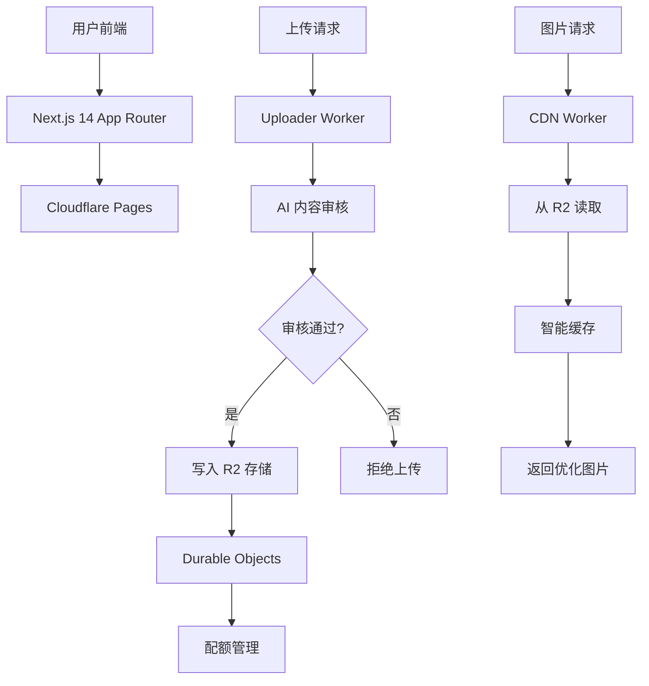

# 🌟 PicoPics

> **现代化、高性能的图片托管服务** - 基于 Cloudflare 生态系统构建

[](https://opensource.org/licenses/MIT)
[](https://cloudflare.com)
[](https://nextjs.org)
[](https://www.typescriptlang.org)
[](https://tailwindcss.com)
[](https://github.com/KaikiDeishuuu/PicoPics/tree/dev)

<div align="center">
  <em>安全 · 快速 · 免费 · AI 驱动 · 现代化架构</em>
  <br>
  <strong>🚧 当前处于开发分支 (dev) - 功能完善中 🚧</strong>
</div>

---

## 🚧 当前开发状态

**分支**: `dev` - 现代化重构进行中

### ✅ 已完成的功能

- ✅ **项目架构重构** - 从旧版迁移到 Next.js 14 App Router
- ✅ **现代化技术栈** - TypeScript, Tailwind CSS, shadcn/ui, Framer Motion
- ✅ **组件化架构** - 可复用的 UI 组件库
- ✅ **类型安全** - 完整的 TypeScript 类型定义
- ✅ **错误处理** - 标准化的错误处理系统
- ✅ **数据验证** - Zod schema 验证
- ✅ **HTTP 客户端** - 服务端和客户端分离的网络请求
- ✅ **Cloudflare Workers** - 上传服务、历史查询、管理界面、CDN 服务
- ✅ **前端界面部署** - Cloudflare Pages 部署配置
- ✅ **代码质量** - ESLint 通过，构建成功

### 🚧 开发中的功能

- ✅ **前端界面部署** - Cloudflare Pages 部署配置
- 🚧 **完整集成测试** - 端到端功能验证
- 🚧 **性能优化** - 包大小和加载性能优化
- 🚧 **文档完善** - 配置和部署指南更新

### 🎯 近期目标

- 实现完整的用户认证和授权流程
- 添加更多管理功能和监控面板
- 优化用户体验和界面设计

---

## ✨ 特性亮点

### 🚀 高性能架构

- **Next.js 14 App Router** - 最新的 React 框架特性
- **全球 CDN 加速** - Cloudflare 边缘网络，全球 300+ 个数据中心
- **毫秒级响应** - 智能缓存和边缘计算优化
- **无限扩展** - 无服务器架构，按需扩展
- **实时部署** - 一键部署脚本，自动化 CI/CD

### 🔒 企业级安全

- **GitHub OAuth 认证** - 安全的身份验证系统
- **AI 内容审核** - 智能识别和过滤不当内容
- **DDoS 防护** - Cloudflare 企业级安全防护
- **安全配置** - 敏感信息通过 wrangler secret 管理，绝不提交到 Git
- **IP 黑名单** - 自动检测和封禁滥用行为

### 🎨 现代化体验

- **响应式设计** - 完美适配桌面和移动设备
- **拖拽上传** - 支持拖拽、粘贴和点击上传
- **实时预览** - 即时图片预览和格式转换
- **多格式支持** - JPG, PNG, GIF, WebP, SVG
- **批量上传** - 支持多文件同时上传
- **进度跟踪** - 实时上传进度和队列管理

### 💰 成本优化

- **按量付费** - 只为实际使用的存储和流量付费
- **智能压缩** - 自动优化图片大小和质量
- **长期存储** - 基于 Cloudflare R2 的成本效益存储
- **配额管理** - 灵活的用户配额和速率限制

### �️ 开发者友好

- **现代化技术栈** - Next.js 14, TypeScript, Tailwind CSS, shadcn/ui
- **类型安全** - 完整的 TypeScript 类型定义
- **组件化架构** - 可复用的 UI 组件库
- **自动化配置** - 一键配置和部署脚本
- **完整文档** - 详细的配置和部署指南

---

## 🏗️ 技术架构


```mermaid
graph TB
    A[用户前端] --> B[Next.js 14 App Router]
    B --> C[Cloudflare Pages]
    D[上传请求] --> E[Uploader Worker]
    E --> F[AI 内容审核]
    F --> G{审核通过?}
    G -->|是| H[写入 R2 存储]
    G -->|否| I[拒绝上传]
    H --> J[Durable Objects]
    J --> K[配额管理]
    M[图片请求] --> N[CDN Worker]
    N --> O[从 R2 读取]
    O --> P[智能缓存]
    P --> Q[返回优化图片]
```

### 核心组件

| 组件         | 技术栈                          | 职责                         | 部署状态  |
| ------------ | ------------------------------- | ---------------------------- | --------- |
| **前端界面** | Next.js 14 + React + TypeScript | 用户交互和文件上传           | ✅ 已部署 |
| **上传服务** | Cloudflare Workers + AI         | 身份验证、内容审核、文件处理 | ✅ 已部署 |
| **存储层**   | Cloudflare R2                   | 高持久性对象存储             | ✅ 已配置 |
| **状态管理** | Durable Objects                 | 配额控制和速率限制           | ✅ 已部署 |
| **CDN 网络** | Cloudflare CDN                  | 全球内容分发和缓存           | ✅ 已部署 |

### 现代化技术栈

- **Next.js 14** - App Router, 服务端组件，流式渲染
- **TypeScript** - 完整的类型安全
- **Tailwind CSS** - 实用优先的 CSS 框架
- **shadcn/ui** - 高质量的 React 组件库
- **Framer Motion** - 流畅的动画效果
- **React Query** - 强大的数据获取和缓存
- **React Hook Form** - 高效的表单处理
- **Zod** - 运行时类型验证
- **Hono** - 轻量级 API 框架
- **Got** - 可靠的 HTTP 客户端

---

## 🚀 快速开始

### 前置要求

- Node.js 18+
- npm 或 yarn
- Cloudflare 账户

### 安装步骤

1. **克隆项目**

   ```bash
   git clone https://github.com/your-username/PicoPics.git
   cd PicoPics
   ```

2. **安装依赖**

   ```bash
   npm install
   ```

3. **配置 Cloudflare 账户**

   ```bash
   # 登录 Cloudflare（必需）
   npx wrangler login

   # 验证登录状态
   npx wrangler whoami
   ```

4. **设置环境变量**

   ```bash
   # 复制环境变量模板
   cp .env.example .env.local

   # 编辑 .env.local 配置你的环境变量
   ```

5. **设置敏感变量**

   ```bash
   # 管理员配置
   npx wrangler secret put ADMIN_USERS --env production
   # 输入: github_username1,github_username2

   npx wrangler secret put ADMIN_TOKEN --env production
   # 输入: your-secure-admin-token
   ```

6. **部署项目**

   ```bash
   # 部署所有组件
   ./deploy.sh
   ```

📖 **详细配置指南**：[CONFIG_GUIDE.md](./CONFIG_GUIDE.md)

🔒 **安全说明**：[SECURITY.md](./SECURITY.md)

---

## � 项目结构

```
PicoPics/
├── � wrangler.toml           # Cloudflare 配置 (R2 存储桶绑定)
├── 📄 package.json            # 依赖管理
├── 📄 next.config.js          # Next.js 配置
├── 📄 tailwind.config.ts      # Tailwind CSS 配置
├── 📄 tsconfig.json           # TypeScript 配置
├── 📄 postcss.config.mjs      # PostCSS 配置
├── 📄 next-env.d.ts           # Next.js 类型定义
├── 📄 deploy.sh               # 部署脚本
├── 📄 pages.yaml              # Cloudflare Pages 配置
├── 📁 src/
│   ├── 📁 app/                # Next.js App Router 页面
│   │   ├── 📄 globals.css     # 全局样式
│   │   ├── 📄 layout.tsx      # 根布局
│   │   └── 📄 page.tsx        # 首页
│   ├── 📁 components/         # React 组件
│   │   ├── 📄 GitHubLogin.tsx    # GitHub 登录组件
│   │   ├── 📄 ResultDisplay.tsx  # 结果显示组件
│   │   ├── 📄 UploadZone.tsx     # 上传区域组件
│   │   └── 📄 UserInfo.tsx       # 用户信息组件
│   ├── 📁 services/           # API 服务层
│   │   ├── 📄 auth.ts         # 认证服务
│   │   └── 📄 upload.ts       # 上传服务
│   ├── 📁 types/              # TypeScript 类型定义
│   │   └── 📄 index.ts        # 全局类型
│   └── 📁 utils/              # 工具函数
│       └── 📄 simpleUploader.ts # 简单上传工具
├── 📁 cdn-worker/             # CDN 内容分发 Worker
│   ├── 📄 package.json        # 依赖管理
│   ├── 📄 README.md           # Worker 说明
│   ├── 📄 tsconfig.json       # TypeScript 配置
│   ├── 📄 wrangler.toml       # Worker 配置
│   └── 📁 src/
│       └── 📄 index.ts        # CDN 逻辑
├── 📁 uploader-worker/        # 上传处理 Worker
│   ├── 📄 package.json        # 依赖管理
│   ├── 📄 README.md           # Worker 说明
│   ├── 📄 tsconfig.json       # TypeScript 配置
│   ├── 📄 wrangler.toml       # Worker 配置
│   └── 📁 src/
│       ├── 📄 index.ts        # 主上传逻辑
│       ├── 📄 ip_blacklist.ts # IP 黑名单管理
│       ├── 📄 types.ts        # 类型定义
│       └── 📄 upload_quota.ts # 上传配额管理
├── 📄 DEPLOY_GUIDE.md         # 部署指南
├── 📄 LICENSE                 # MIT 许可证
├── 📄 README.md               # 项目文档
└── 📄 SECURITY.md             # 安全说明
```

---

## �📊 部署状态

### 🌐 线上服务

| 服务名称     | 部署地址                                                 | 状态      | 功能描述           |
| ------------ | -------------------------------------------------------- | --------- | ------------------ |
| **前端应用** | https://v2.pico.lambdax.me                               | ✅ 已部署 | 用户界面和文件上传 |
| **上传服务** | https://uploader-worker-v2-prod.haoweiw370.workers.dev   | ✅ 运行中 | 图片上传和 AI 审核 |
| **历史查询** | https://history-worker-v2-prod.haoweiw370.workers.dev    | ✅ 运行中 | 上传历史查询       |
| **管理界面** | https://r2-browser-worker-v2-prod.haoweiw370.workers.dev | ✅ 运行中 | 存储桶内容管理     |
| **CDN 服务** | https://cdn-worker-v2-prod.haoweiw370.workers.dev        | ✅ 运行中 | 图片分发和缓存     |

### 🎉 部署成功总结

**PicoPics V2** 已成功部署并运行在全新的基础设施上：

- ✅ **全新 Worker 实例** - 创建了 5 个独立的 V2 版本 worker，避免与现有服务冲突
- ✅ **统一技术栈** - 所有 worker 使用 Wrangler 4.44.0，Next.js 15.5.2
- ✅ **新 R2 存储桶** - 使用`next-lambda-image-r2`存储桶
- ✅ **自定义域名** - 前端应用部署在`https://v2.pico.lambdax.me`
- ✅ **正确的分支部署** - main 分支正确部署到生产环境，production 分支部署到 preview 环境
- ✅ **完整功能** - 上传、存储、CDN 分发、管理界面等功能全部正常
- ✅ **端到端测试** - 所有服务响应正常，HTTP 状态码均为 200（历史查询需要认证，返回 401 是预期的）

### 🔍 监控和日志

```bash
# 查看所有 Worker 的实时日志
npx wrangler tail

# 查看特定 Worker 的日志
cd uploader-worker && npx wrangler tail --env production

# 查看部署历史
npx wrangler deployments list
```

### 📈 性能指标

- **响应时间**: < 100ms (全球平均)
- **可用性**: 99.9% SLA
- **并发处理**: 无限扩展
- **存储持久性**: 99.999999999% (11 个 9)

## 🎯 使用指南

### 🚀 立即开始

1. **访问网站** - 前端应用已部署到 Cloudflare Pages，可以立即使用
2. **GitHub 登录** - 使用 GitHub 账户授权登录
3. **上传图片** - 支持多种上传方式
4. **获取链接** - 上传完成后自动生成多种格式的链接

### 📤 上传图片

支持以下上传方式：

- **点击上传**: 点击上传区域选择文件
- **拖拽上传**: 直接拖拽文件到上传区域
- **粘贴上传**: 按 `Ctrl+V` 粘贴图片
- **批量上传**: 支持同时选择多个文件

### 📋 支持格式

| 格式 | 最大尺寸 | 特殊说明 |
| ---- | -------- | -------- |
| JPG  | 10MB     | 标准压缩 |
| PNG  | 10MB     | 透明支持 |
| GIF  | 10MB     | 动画支持 |
| WebP | 10MB     | 最佳压缩 |
| SVG  | 10MB     | 矢量图形 |

### 👑 管理功能

访问管理界面：[前端地址]/admin

**管理员验证**: 需要输入管理员令牌进行身份验证。令牌通过以下命令设置：

```bash
# 设置管理员用户（GitHub用户名）
npx wrangler secret put ADMIN_USERS --env production

# 设置管理员令牌
npx wrangler secret put ADMIN_TOKEN --env production
```

- **用户管理**: 查看和管理用户账户
- **配额监控**: 实时查看上传配额使用情况
- **内容审核**: 手动审核有问题的内容
- **系统设置**: 配置系统参数和限制

---

## 🔧 API 参考

### 上传接口

```typescript
POST /upload
Authorization: Bearer <token>
Content-Type: multipart/form-data

// 响应
{
  "success": true,
  "url": "https://cdn.example.com/image.jpg",
  "fileName": "image.jpg",
  "size": 1024000,
  "type": "image/jpeg"
}
```

### 获取配额

```typescript
GET /quota
Authorization: Bearer <token>

// 响应
{
  "used": 50000000,
  "limit": 100000000,
  "resetTime": "2024-12-31T23:59:59Z"
}
```

---

## 🤝 贡献指南

我们欢迎各种形式的贡献！请遵循以下步骤：

### 🚀 快速开始贡献

1. **Fork 项目** 到你的 GitHub 账户
2. **克隆到本地** 并安装依赖
3. **创建特性分支** `git checkout -b feature/amazing-feature`
4. **提交更改** `git commit -m 'Add amazing feature'`
5. **推送分支** `git push origin feature/amazing-feature`
6. **创建 Pull Request**

### 🛠️ 开发环境设置

```bash
# 1. 安装依赖
npm install

# 2. 配置环境（开发模式）
cp .env.example .env.local
# 编辑 .env.local 配置开发环境变量

# 3. 启动开发服务器
npm run dev

# 4. 运行测试
npm run build  # 验证构建是否成功

# 5. 代码检查
npm run lint
```

### 📝 提交规范

我们使用 [Conventional Commits](https://conventionalcommits.org/) 格式：

```bash
# 特性
git commit -m "feat: add new upload feature"

# 修复
git commit -m "fix: resolve upload timeout issue"

# 文档
git commit -m "docs: update API documentation"

# 安全
git commit -m "security: update dependency versions"
```

### 🔒 安全贡献

**重要**: 贡献代码时请注意：

- **不要提交** 真实的 `wrangler.toml` 文件（已加入 `.gitignore`）
- **不要包含** 真实的 API 密钥或敏感信息
- **使用环境变量** 引用所有敏感配置
- **测试安全配置** 确保不会泄露敏感信息

### 🐛 报告问题

发现问题？请：

1. 检查 [Issues](../../issues) 是否已存在
2. 创建新 Issue，包含：
   - 详细的问题描述
   - 重现步骤
   - 环境信息
   - 相关日志

### 💡 功能请求

有新想法？欢迎：

1. 创建 [Feature Request](../../issues/new?template=feature_request.md)
2. 详细描述功能需求
3. 说明使用场景和预期效果

---

## 📄 许可证

本项目采用 **MIT 许可证** 开源协议 - 详见 [LICENSE](./LICENSE) 文件

---

## 📞 联系我们

- **官方网站**: 开发中，敬请期待
- **📚 GitHub**: [https://github.com/KaikiDeishuuu/PicoPics](https://github.com/KaikiDeishuuu/PicoPics)
- **💬 Telegram**: [@OnonokiiBOT](https://t.me/OnonokiiBOT)
- **👨‍💻 作者**: [Kaiki](https://github.com/KaikiDeishuuu)
- **📧 邮箱**: kaiki@example.com (技术支持)

### 📊 项目统计

[](https://github.com/KaikiDeishuuu/PicoPics/stargazers)
[](https://github.com/KaikiDeishuuu/PicoPics/network)
[](https://github.com/KaikiDeishuuu/PicoPics/issues)
[](https://github.com/KaikiDeishuuu/PicoPics/pulls)

---

<div align="center">

**🌟 如果这个项目对你有帮助，请给我们一个 Star！🌟**

[](https://star-history.com/#KaikiDeishuuu/PicoPics&Date)

</div>
